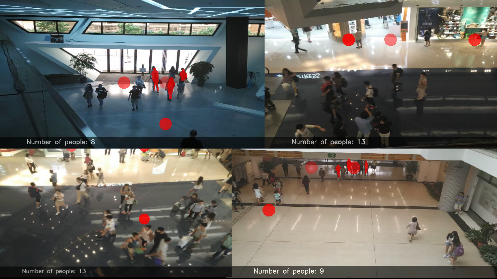

# Visual Crowd Detector

Application detecting gatherings of people on images. It's goal is to help fight against
COVID-19 by pinpointing the most crowded spots. It was created while participating in https://www.hackcrisis.com/ 
hackathon.

## Example of usage
People profiles marked in red marks gatherings. Red dots represents points where a lot of people have been passing.
At the bottom total number of people in the image is shown.


## Environment preparation
We strongly recommend docker usage, as it helps to keep dependencies for different project separate. If you prefer not
to use it, install the dependencies from by running: `pip install -r requirements.txt`.

Whole development environment is managed by Makefile. There are the following commands:
* `make build` - creates docker image and installs required dependencies
* `make dev` - starts the image and give access to the console
* `make dev_gui` - TODO
* `make lab` - starts the image and jupyter lab environment

## Before use
You need to download the weights for the network from: `http://download.tensorflow.org/models/object_detection/mask_rcnn_inception_v2_coco_2018_01_28.tar.gz`

## Usage
For a fast start with default values use: `python detector.py`. More details about parameters are provided below:
```
NAME
    detector.py - Main loop of the application. Iterates through all frames in the input video detects people and marks dangerous regions.

SYNOPSIS
    detector.py <flags>

DESCRIPTION
    Main loop of the application. Iterates through all frames in the input video detects people and marks dangerous regions.

FLAGS
    --model_path=MODEL_PATH
        Path to the inference graph.
    --video_path=VIDEO_PATH
        Path to the input video
```